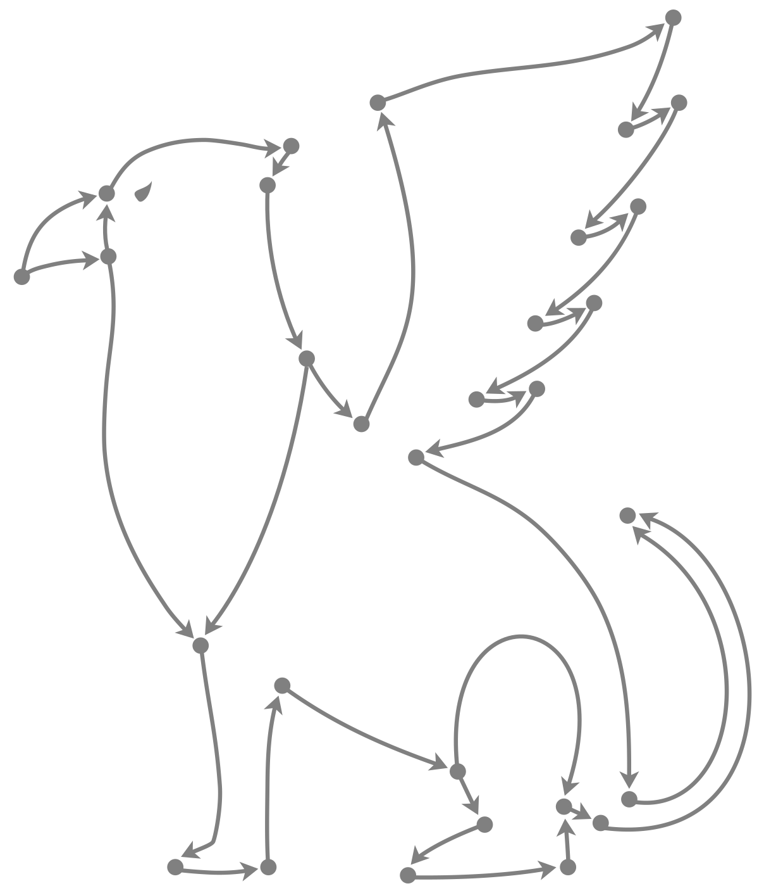
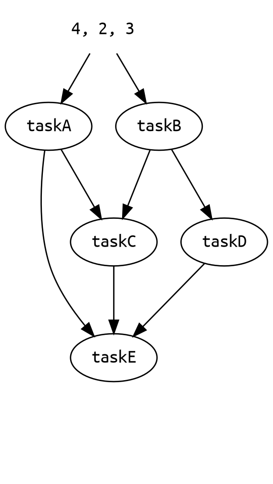

<div align="center">
  
</div>

<h1 align="center">grfnviz</h1>

<div align="center">
  <a href="https://npmjs.org/package/grfnviz">
    
  </a>
  <a href="https://packagephobia.now.sh/result?p=grfnviz">
    
  </a>
</div>

<div align="center">
  A snazzy utility for generating SVGs and GIFs from grfn dependency graphs.
</div>

## Table of Contents

- [Install](#install)
- [Usage](#usage)
- [API](#api)
- [Contributing](#contributing)
- [License](#license)

## Install

```sh
$ npm i -D grfnviz
```

For the [`graphviz`](https://www.npmjs.com/package/graphviz) dependency to work, you'll need to install [GraphViz for your operating system](http://www.graphviz.org/download#executable-packages).

## Usage




Read [`grfn`'s readme](../..) first! Otherwise this readme won't make any sense.

An illustrative example:

```js
import { promises as fs } from 'fs'
import grfn from 'grfn'
import { getSvg, getPng, previewInBrowser, gifn } from 'grfnviz'

const delay = timeout => new Promise(resolve => setTimeout(resolve, timeout))

async function taskA(n1, n2, n3) {
  await delay(15)
  return n1 + n2 + n3
}

async function taskB(n1, n2, n3) {
  await delay(10)
  return n1 * n2 * n3
}

async function taskC(a, b) {
  await delay(5)
  return a + b
}

async function taskD(b) {
  await delay(1)
  return b * 2
}

async function taskE(a, c, d) {
  await delay(10)
  return a * c * d
}

const runTasks = grfn([
  [taskE, [taskA, taskC, taskD]],
  [taskD, [taskB]],
  [taskC, [taskA, taskB]],
  taskA,
  taskB
])

// Get a PNG of your dependency graph as a Buffer
const pngBuffer = await getPng(runTasks)
await fs.writeFile(pngBuffer, 'myfancygraph.png')

// Get an SVG of your dependency graph as a Buffer
const svgBuffer = await getSvg(runTasks)
await fs.writeFile(svgBuffer, 'myfancygraph.svg')

// Or preview your graph in the browser!
// The promise resolves when the page has been opened
await previewInBrowser(runTasks)

// Create a function that runs your graph AND generates a GIF
const runTasksAndGenerateGif = gifn(runTasks)

// Runs your graph and get the output and GIF of the run as a Buffer!
const { output, gif } = await runTasksAndGenerateGif(4, 2, 3)
await fs.writeFile(gif, 'myfancygraphrun.gif')
```

## API

### `getPng(grfn) => Promise<Buffer>`

Returns a `Promise` that resolves to a PNG of the dependency graph of `grfn` as a `Buffer`. The `grfn` argument must be a function returned by the `grfn` package.

### `getSvg(grfn) => Promise<Buffer>`

Returns a `Promise` that resolves to an SVG of the dependency graph of `grfn` as a `Buffer`. The `grfn` argument must be a function returned by the `grfn` package.

### `openInBrowser(grfn) => Promise<void>`

Returns a `Promise` that resolves when a preview of the dependency graph of `grfn` is opened in the browser. The `grfn` argument must be a function returned by the `grfn` package. The preview is opened using a [data URI](https://developer.mozilla.org/en-US/docs/Web/HTTP/Basics_of_HTTP/Data_URIs) so the data is not uploaded anywhere.

### `gifn(grfn) => (...args) => Promise<{ output, gif: Buffer }>`

Returns a function that runs `grfn` with the given `args` as input while also generating a GIF of the run. The `grfn` argument must be a function returned by the `grfn` package.

The returned function returns a `Promise` that resolves to an object with the following properties:

- `output`: contains the output of the `grfn` function
- `gif`: a GIF of the run as a `Buffer`

## Contributing

Stars are always welcome!

For bugs and feature requests, [please create an issue](https://github.com/TomerAberbach/grfn/issues/new).

For pull requests, please read the [contributing guidelines](https://github.com/TomerAberbach/grfn/blob/main/contributing.md).

## License

[Apache 2.0](https://github.com/TomerAberbach/grfn/blob/main/license)

This is not an official Google product.
