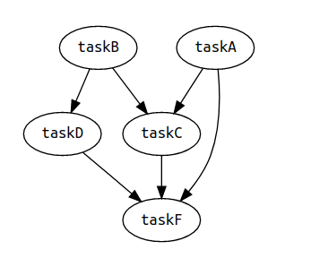

# grfn

> A tiny (~400B) utility that executes a dependency graph of async functions as concurrently as possible.

## Features

- **Lightweight:** less than 400 bytes gzipped
- **Unobtrusive and Unopiniated:** takes normal functions; returns a normal function!
- **Isomorphic:** works in node and the browser
- **Easy Debugging:** provides cycle detection and SVG dependency graph previews through a `grfn/debug` module!

## Table of Contents

- [Install](#install)
- [Usage](#usage)
- [API](#api)
- [Contributing](#contributing)
- [License](#license)

## Install

```sh
$ npm i grfn
```

To use the `grfn/debug` module, install the following dev dependencies:

```sh
$ npm i -D graphviz open
```

For the [`graphviz`](https://www.npmjs.com/package/graphviz) package to work, you'll need to install [GraphViz for your operating system](http://www.graphviz.org/download#executable-packages).

## Usage

Check out `grfn`'s very own [build file](https://github.com/TomerAberbach/grfn/blob/main/build.js) for a real world usage example!

A illustrative example:

```js
import grfn from 'grfn'

const delay = timeout => new Promise(resolve => setTimeout(resolve, timeout))
const withLogging = fn =>
  Object.defineProperty(
    async (...args) => {
      console.log(`${fn.name} input: ${args.join(`, `)}`)
      const output = await fn(...args)
      console.log(`${fn.name} output: ${output}`)
      return output
    },
    `name`,
    {
      enumerable: false,
      writable: false,
      value: fn.name
    }
  )

const taskA = withLogging(async function taskA(n1, n2, n3) {
  await delay(15)
  return n1 + n2 + n3
})

const taskB = withLogging(async function taskB(n1, n2, n3) {
  await delay(10)
  return n1 * n2 * n3
})

const taskC = withLogging(async function taskC(a, b) {
  await delay(5)
  return a + b
})

const taskD = withLogging(async function taskD(b) {
  await delay(1)
  return b * 2
})

const taskF = withLogging(async function taskF(a, c, d) {
  await delay(10)
  return a * c * d
})

const runTasks = grfn([
  // `taskF` depends on `taskA`, `taskC`, and `taskD`
  // Call `taskF` with the results of the functions
  // once their returned promises resolve
  [taskF, [taskA, taskC, taskD]],

  [taskD, [taskB]], // `taskD` depends on `taskB`
  [taskC, [taskA, taskB]], // `taskC` depends on `taskA` and `taskB`

  // `taskA` and `taskB` have no dependencies!
  // They take the input given to `runTasks`
  taskA,
  taskB
])

const main = async () => {
  const output = await runTasks(1, 2, 3)

  // This will be the output of `taskF`
  // because no function depends on it!
  console.log(`final output: ${output}`)
}

main()
```

Output:

```
taskA input: 1, 2, 3
taskB input: 1, 2, 3
taskB output: 6
taskD input: 6
taskD output: 12
taskA output: 6
taskC input: 6, 6
taskC output: 12
taskF input: 6, 12, 12
taskF output: 864
final output: 864
```

### Debugging

```js
import grfn from 'grfn'
import 'grfn/debug'

// ...

// The `preview` property is only available
// in node when `grfn/debug` has been imported
grfn.preview([
  [taskF, [taskA, taskC, taskD]],
  [taskD, [taskB]],
  [taskC, [taskA, taskB]],
  taskA,
  taskB
])
```

Opens the following SVG in the browser:



## API

### `grfn(vertices) => (...args) => Promise`

Returns a function that runs the dependency graph of functions described by `vertices`:

- Input: passed to the functions that don't have dependencies in the graph
- Output: a `Promise` that resolves to the value returned from the graph's _output function_, the function that is not depended on by any function

#### `vertices`

Type: `(Function | [Function, Function[]])[]`

An array describing a dependency graph of functions.

Each value in `vertices` must be either:

- A pair containing a function and its array of function dependencies (e.g. `[fnA, [fnB, fnC]]`)
- Or a function (equivalent to `[fn, []]`)

The following constraints, which are verified when `grfn/debug` is imported before calling `grfn`, must also be met:

- Each dependency in `vertices` must also appear as a non-dependency:
  - Not okay (`fnB` doesn't appear as a non-dependency):
    <!-- prettier-ignore -->
    ```js
    grfn([
      [fnA, [fnB]]
    ])
    ```
  - Okay:
    <!-- prettier-ignore -->
    ```js
    grfn([
      [fnA, [fnB]],
      fnB
    ])
    ```
- `vertices` must describe an [acyclic](https://en.wikipedia.org/wiki/Directed_acyclic_graph) dependency graph:
  - Not okay (cycle: `fnA -> fnB -> fnA`):
    <!-- prettier-ignore -->
    ```js
    grfn([
      [fnA, [fnB]],
      [fnB, [fnA]]
    ])
    ```
  - Okay:
    <!-- prettier-ignore -->
    ```js
    grfn([
      [fnA, [fnB]],
      fnB
    ])
    ```
- `vertices` must have exactly one _output function_, a function that is not depended on by any function:
  - Not okay (both `fnB` and `fnC` are not depended on by any function):
    <!-- prettier-ignore -->
    ```js
    grfn([
      [fnB, [fnA]],
      [fnC, [fnA]],
      fnA
    ])
    ```
  - Okay:
    <!-- prettier-ignore -->
    ```js
    grfn([
      [fnD, [fnB, fnC]],
      [fnB, [fnA]],
      [fnC, [fnA]],
      fnA
    ])
    ```

### `grfn.preview(vertices) => Promise<void>`

Only available in node after `grfn/debug` is imported.

Generates an SVG of the dependency graph described by `vertices` and returns a `Promise` that resolves when the SVG is opened in the browser (it uses a [data URL](https://developer.mozilla.org/en-US/docs/Web/HTTP/Basics_of_HTTP/Data_URIs) so the SVG is not uploaded anywhere).

### `vertices`

Type: `(Function | [Function, Function[]])[]`

Same as `grfn`'s [`vertices`](#vertices) parameter except `grfn.preview` will attempt to generate the SVG even if the given `vertices` do not meet the constraints (to aid in debugging).

## Contributing

Stars are always welcome!

For bugs and feature requests, [please create an issue](https://github.com/TomerAberbach/grfn/issues/new).

For pull requests, please read the [contributing guidelines](https://github.com/TomerAberbach/grfn/blob/main/contributing.md).

## License

[Apache 2.0](https://github.com/TomerAberbach/grfn/blob/main/license)

This is not an official Google product.
